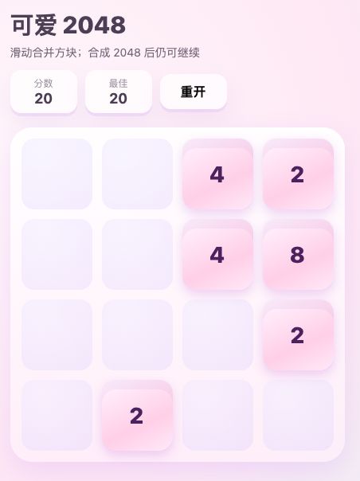

# 可爱风 2048（Vite + Vue 3）

浏览器 H5 版 2048：可爱配色、方块位移动画、滑动时画布粒子与其它视效。**`vite.config.ts` 已设 `base: './'`**，便于静态托管。

## 界面预览



移动端优先的 H5 界面：柔和粉紫 pastel 配色、圆角卡片与轻阴影（偏新拟态质感）。顶部为中文标题「可爱 2048」与玩法说明（滑动合并方块；合成 2048 后仍可继续）。分数条并列展示当前分数与最佳纪录，并提供「重开」一键重置。棋盘为 **4×4** 格，方块采用渐变粉红底与深紫数字，风格简洁偏「可爱 / kawaii」，适合浏览器或 itch.io 静态托管试玩。

## 本地运行

```bash
npm install
npm run dev
```

## 测试

```bash
npm run test
```

## 构建与 itch.io

1. **构建**

   ```bash
   npm run build
   ```

2. **自检（可选）**

   ```bash
   npm run preview
   ```

   `dist/index.html` 中的脚本与样式应为 `./assets/...` 相对路径。

3. **上传 itch.io**

   - 在项目页选择 **上传 HTML**，类型为 Web 小游戏。
   - 将 **`dist/` 目录下的全部内容**打 zip（解压后根目录须有 `index.html` 与 `assets/`，不要把整个仓库根目录打进去）。
   - 启动入口选 **`index.html`**。
   - 发布后即可用 itch 自带的「在浏览器中运行」在线试玩。

## 文档

设计与实现计划：

- `docs/superpowers/specs/2026-04-28-h5-2048-vite-vue-design.md`
- `docs/superpowers/plans/2026-04-28-h5-2048-cute-game.md`
- OpenSpec：`openspec/changes/h5-2048-cute-game/`
